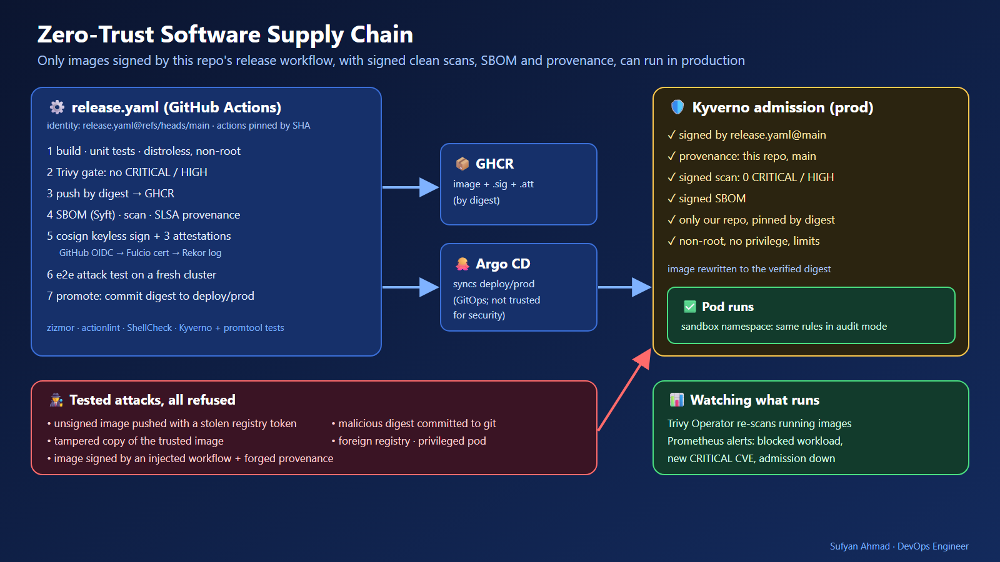
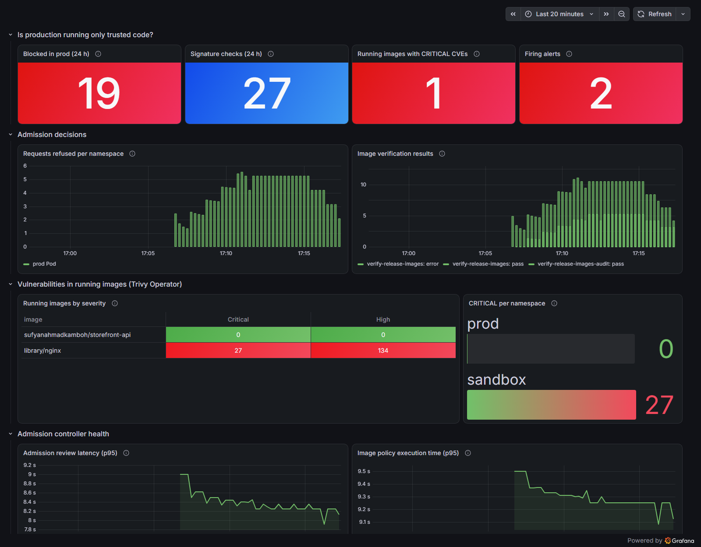

# Zero-Trust Software Supply Chain for Kubernetes

Production runs **only** container images that this repository's release workflow built, scanned and signed.
Everything else is refused at the cluster door, including:
- images pushed with a **stolen registry token**
- **tampered** copies of a trusted image
- images with a **valid signature from a different (injected) workflow**, with forged provenance
- a **malicious digest committed to git** and applied by GitOps

Each release carries four signed pieces of evidence (signature, SLSA provenance, vulnerability scan, SBOM). Kyverno
checks all of them before any pod starts, and Trivy Operator keeps re-scanning what runs.




> 📚 **New to DevOps security? Start with the [study guide](study/README.md)** (also available as a single **[PDF](study/study-guide.pdf)**). It teaches every piece of this project from zero: container images, supply-chain attacks, GitHub Actions security, SBOMs, vulnerability scanning, Sigstore, SLSA provenance, Kyverno, Pod Security, Argo CD and monitoring. It includes 9 hands-on labs and 25 interview questions.

> 🎬 **Prefer video?** A 28-minute walkthrough of every tool, its configuration, a hands-on lab on your laptop and the production rollout is built from code in [video/](video/README.md), with the YouTube upload package (description, chapters, captions, thumbnail).

**Measured on GitHub Actions** (fresh kind cluster, every release; details in [docs/test-results.md](docs/test-results.md)):

| Attack | Result |
|---|---|
| Image from another registry | **refused** in 484 ms |
| Unsigned image pushed to our registry (stolen token) | **refused** in 2,058 ms |
| Tampered copy of the trusted image (extra layer) | **refused** in 1,968 ms |
| Image with a **valid** keyless signature from an injected workflow, plus forged provenance and scan | **refused** in 1,970 ms |
| Trusted image in a privileged pod | **refused** in 363 ms |
| Malicious digest committed to `deploy/prod` (GitOps) | Argo CD applied it, the cluster **refused** it 6 s after the push; production kept serving |
| Old image with known CVEs already running (sandbox) | Trivy Operator found 27 CRITICAL; alert **fired** |
| Control: the real signed release | **admitted** in 4,002 ms |

---

## 1. Problem statement

A Kubernetes cluster usually trusts any image it can pull from "our" registry. That trust is misplaced: the
registry only proves that *someone with a token* pushed an image, not that *our reviewed code* was built into it by
*our pipeline*. Git is not proof either: whoever can write to the deploy repository decides what runs.

## 2. Pain point

The 2025–2026 attacks went exactly through these gaps:
- **Injected workflows:** malicious GitHub Actions workflows were committed to thousands of repositories in a few
  hours (the "Megalodon" campaign, 2026), so builds ran attacker code with the repository's identity.
- **Moved tags:** popular actions had their version tags moved to malicious commits (tj-actions/changed-files,
  2025), stealing CI secrets.
- **Stolen registry credentials:** with a leaked token anyone can push an image under the same name.

A scanner in CI does not help when the image that runs is not the one that was scanned.

## 3. Objectives

1. Run an image in `prod` **only** with cryptographic proof that `release.yaml` on `main` of this repository built
   it, from this repository's source, with a clean scan and an SBOM.
2. Need **no long-lived signing keys** (nothing to steal or rotate).
3. Harden the pipeline itself: pinned actions, least-privilege tokens, workflow linting.
4. Prove the defences on **every release** by attacking a fresh cluster, and promote only if every attack fails.
5. Keep watching what runs: new CVEs and blocked attempts raise alerts.

## 4. Architecture

```
git push main ─► release.yaml ─► build · Trivy gate · push by digest · SBOM · scan · SLSA provenance
                                  cosign keyless (GitHub OIDC ─► Fulcio cert ─► Rekor log)
                                  e2e.yaml: fresh kind cluster, attack scenarios must all fail
                                  promote: commit the digest to deploy/prod
Argo CD ─► Kubernetes API ─► Kyverno (prod: Deny, sandbox: Audit) ─► Pod ─► Trivy Operator ─► Prometheus/Grafana
```

Details, trust boundaries and a 14-entry decision log: **[docs/architecture.md](docs/architecture.md)**.

## 5. Technologies

| Tool | Version | Used for |
|---|---|---|
| Go | 1.27 | `storefront-api`, the sample service |
| Docker, distroless | static-debian13 nonroot | 3.7 MB non-root image, base images pinned by digest |
| GitHub Actions + GHCR | — | build platform (its OIDC identity signs) and registry |
| Sigstore cosign | 3.1.3 | keyless signatures and attestations (Fulcio, Rekor) |
| Syft | 1.54.0 | CycloneDX SBOM |
| Trivy | 0.75.0 | build gate and signed scan report |
| Kyverno | 1.19.1 | admission: ImageValidatingPolicy + ValidatingPolicy (CEL) |
| Argo CD | 3.5.3 | GitOps for `deploy/prod` |
| Trivy Operator | 0.34.0 | re-scans running images |
| Prometheus, Grafana | 3.15.0, 13.2.3 | alerts (promtool-tested) and dashboard |
| kind, Kustomize | 0.33.0, Kubernetes 1.37 | lab and CI clusters, prod/sandbox overlays |
| zizmor, actionlint, ShellCheck, hadolint, yamllint | 1.30.1, 1.7.12, …, 2.15.1, 1.38.0 | static checks |

## 6. Repository structure

```
app/                     Go service + Dockerfile (tests run inside the build)
deploy/base, deploy/prod Kustomize: Deployment, Service, PDB, NetworkPolicy; prod pins the image digest
policies/base            Kyverno policies; prod (Deny) and sandbox (Audit) overlays; policies/tests (kyverno test)
platform/                kind config, Argo CD Application, Prometheus, Grafana, alert rules, dashboard
scripts/                 platform-up.sh, e2e.sh (attack test), diagnostics, cleanup; scripts/ci (tools, provenance, pin check)
tools/toolbox            container with kubectl, helm, cosign, crane, kyverno (pinned, checksummed)
tests/prometheus         promtool unit tests for the alert rules
.github/workflows        ci.yaml (static checks), release.yaml (build/sign/promote), e2e.yaml (attack test)
docs/                    architecture, runbook, troubleshooting, test results
study/                   beginner study guide (16 chapters, labs, glossary, interview questions, PDF)
```

## 7. Prerequisites

- Docker and Bash (Linux, macOS, or Git Bash on Windows)
- [kind](https://kind.sigs.k8s.io/) 0.33+
- 4 CPUs and 8 GB RAM free for the lab cluster

Every other CLI (kubectl, helm, cosign, crane, kyverno) runs inside the toolbox image that the scripts build.

## 8. Quick start

```bash
git clone https://github.com/sufyanahmadkamboh/sufyan-devops-secure-supply-chain.git
cd sufyan-devops-secure-supply-chain
scripts/platform-up.sh        # kind + Kyverno + Argo CD + Trivy Operator + Prometheus + Grafana (~3 min)
```

Argo CD then deploys the signed release from `deploy/prod`. Now try it yourself, one command per exercise:

```bash
scripts/try.sh status          # what runs where; the release in prod is pinned to its digest
scripts/try.sh verify          # check the signature and 3 attestations yourself, like the cluster does
scripts/try.sh wrong-identity  # expect a different signing workflow: verification fails
scripts/try.sh trusted         # the signed release as a pod in prod: ADMITTED
scripts/try.sh foreign         # a Docker Hub image in prod: REFUSED (allowed-images)
scripts/try.sh unsigned        # your own image under the trusted name: REFUSED (no signature)
scripts/try.sh privileged      # the trusted image, privileged: REFUSED (Pod Security)
scripts/try.sh sandbox         # audit mode: allowed, and reported in a PolicyReport
scripts/try.sh scan            # Trivy Operator finds the CVEs in a running nginx:1.21.0
scripts/try.sh alerts          # Prometheus alerts
scripts/try.sh dashboard       # Grafana on http://localhost:3000
scripts/try.sh clean           # remove the exercise pods
```

To run your own commands, load the helpers: `source scripts/lib.sh`, then `k` is kubectl and `tb` runs any tool
from the toolbox (for example `k -n prod get pods`). The [study guide labs](study/15-hands-on-labs.md) go further.

## 9. Configuration

| What | Where |
|---|---|
| Trusted identity (workflow file + branch) | `policies/base/verify-images.yaml` (`attestors.keyless.identities`) |
| Allowed image repository | `policies/base/allowed-images.yaml`, `verify-images.yaml` (`matchImageReferences`) |
| Vulnerability threshold | `verify-images.yaml` (CRITICAL/HIGH) and the Trivy gate in `release.yaml` |
| Which namespaces enforce / audit | namespace labels `supply-chain.sufyan.dev/enforce` and `/audit` |
| Released digest | `deploy/prod/kustomization.yaml` (written by the `promote` job) |
| Alert thresholds | `platform/monitoring/rules.yaml` |

To use this in your own organisation, change the identity, repository and image name in the three policy files,
then follow the "Protect the trust anchor" section of the [runbook](docs/runbook.md).

## 10. Testing

| Layer | Where | What it proves |
|---|---|---|
| Pipeline security | `ci.yaml` → pipeline-security | every action pinned to a SHA, actionlint, zizmor (no template injection, least-privilege tokens) |
| Code | `ci.yaml` → code | `go vet`, `go test -race`, ShellCheck, hadolint |
| Manifests | `ci.yaml` → manifests | 12 `kyverno test` cases (incl. look-alike repositories, tags vs digests, unsafe pods, pod-level `runAsNonRoot`), Kustomize renders, promtool rule checks and unit tests, dashboard JSON, yamllint |
| Release | `release.yaml` → build | Trivy gate, the published signature and attestations verify with the cluster's identity rule |
| Attack test | `e2e.yaml` (`scripts/e2e.sh`) | fresh cluster: GitOps deploy, 5 direct attacks, GitOps attack, audit mode, running-image CVEs, alerts |

## 11. Results (measured)

The table at the top comes from release run [37119604685](https://github.com/sufyanahmadkamboh/sufyan-devops-secure-supply-chain/actions/runs/37119604685).
Full numbers, commands, raw outputs and the signature-format experiments: **[docs/test-results.md](docs/test-results.md)**.

## 12. Monitoring



*Local lab after a demo: the promoted release running in prod, and 9 unsigned plus 10 foreign-image attempts
refused (19). The p95 admission latency of about 9 s is real for this laptop: each unsigned-image check asks GHCR
and Rekor for signatures, and those requests land in Kyverno's 5–10 s histogram bucket. On GitHub's runners the
same refusals took about 2 s (table above).*

The dashboard ([platform/monitoring/dashboard.json](platform/monitoring/dashboard.json)) answers "what runs and
why": blocked requests per namespace, image-policy results, CRITICAL/HIGH vulnerabilities in running images, and
admission controller health.

**Alert rules** ([platform/monitoring/rules.yaml](platform/monitoring/rules.yaml)), each with a promtool unit test:
- `UntrustedWorkloadBlocked`: Kyverno refused something in `prod` in the last 10 minutes.
- `RunningImageHasCriticalVulnerabilities`: a running image has CRITICAL CVEs (for 5 minutes).
- `AdmissionControllerDown`: Kyverno's admission metrics are gone (for 5 minutes).

## 13. Security

- **No signing keys:** keyless signatures; the certificate names the exact workflow file and branch, and every
  signature is in the public Rekor log.
- **Pipeline:** `permissions: {}` by default and per-job grants; actions pinned by commit SHA (checked by
  `scripts/ci/check-pinned-actions.sh`); no `${{ }}` inside `run:`; `persist-credentials: false`; tools downloaded
  by checksum; zizmor and actionlint on every push; CODEOWNERS on workflows and policies; Dependabot.
- **Image:** distroless static, non-root (65532), no shell, base images pinned by digest, `-trimpath`.
- **Runtime:** Pod Security "restricted" on `prod`, read-only root filesystem, all capabilities dropped,
  NetworkPolicy (ingress on the HTTP port only, no egress).
- **Trust anchor:** `release.yaml` on `main` is the single thing everything trusts. Protect it with branch
  protection and required reviews ([runbook](docs/runbook.md)).
- No secrets in the repository: the pipeline uses the job's `GITHUB_TOKEN` and OIDC only.

## 14. Troubleshooting

See **[docs/troubleshooting.md](docs/troubleshooting.md)**: signature format, Rekor URL, CEL payload paths,
webhook start-up race, headless metrics service, Pod Security vs Kyverno messages, GitOps refusals, CI linters.

## 15. Failure scenarios

| Failure | What happens |
|---|---|
| Kyverno down | `failurePolicy: Fail`: no new pods in `prod` until it is back; running pods unaffected; `AdmissionControllerDown` fires |
| Sigstore (Fulcio/Rekor) unavailable during a release | signing fails, nothing is promoted; production keeps the previous digest |
| A dependency gets a CRITICAL CVE before release | the Trivy gate fails the build; nothing is published |
| A CVE is published after release | Trivy Operator reports it; `RunningImageHasCriticalVulnerabilities` fires; fix and re-release |
| A bad digest lands in git | Kyverno refuses the Deployment update; Argo CD shows the sync error; `UntrustedWorkloadBlocked` fires |
| The attack test fails | `promote` does not run; `deploy/prod` keeps the last good digest |

## 16. Operations

The **[runbook](docs/runbook.md)** covers protecting the trust anchor, daily questions (what runs, which commit,
what is inside), alert responses, releases, rollback (`git revert`), emergency exceptions and revocation.

## 17. Cleanup

```bash
kind delete cluster --name supply-chain
docker image rm ssc-toolbox:dev
```

The CI attack test deletes its temporary branch and `e2e-*` image versions itself (`scripts/e2e-cleanup.sh`).

## 18. Limitations

- Signing runs in the same job as the build, so this is SLSA Build Level 2-style provenance, not Level 3 (isolated
  provenance generation).
- Signatures use cosign's classic format, because Kyverno 1.19 did not find signatures in the new bundle format
  during testing.
- Admission control does not protect against cluster administrators, who can remove the policies.
- The vulnerability rule reads the scan from release time; newer CVEs are caught by Trivy Operator and alerts,
  not by admission.
- Public Sigstore is used; air-gapped clusters need a private Sigstore deployment.

## 19. Future improvements

- SLSA Build L3 with the `slsa-github-generator` reusable workflow (isolated provenance).
- Sigstore bundle format once Kyverno reads it.
- Signed policy bundles and policy-as-code review in Argo CD.
- Verify base-image signatures (distroless is signed) during the build.
- Re-attest scans nightly and fail admission on stale scans.

## 20. Learning resources

- The **[study guide](study/README.md)** for this project ([PDF](study/study-guide.pdf)), with labs and
  [interview questions](study/interview-questions.md)
- [Sigstore documentation](https://docs.sigstore.dev/) · [SLSA specification](https://slsa.dev/spec/v1.0/)
- [Kyverno ImageValidatingPolicy](https://kyverno.io/docs/policy-types/image-validating-policy/)
- [GitHub: security hardening for Actions](https://docs.github.com/en/actions/security-for-github-actions/security-guides/security-hardening-for-github-actions)
- [zizmor](https://docs.zizmor.sh/) · [Trivy Operator](https://aquasecurity.github.io/trivy-operator/)

## 21. Skills demonstrated

- Software supply-chain security: keyless signing, SLSA provenance, SBOMs, signed vulnerability attestations
- Kubernetes admission control with Kyverno CEL policies, Pod Security Admission, NetworkPolicy
- GitHub Actions hardening: SHA pinning, least privilege, OIDC, workflow static analysis
- GitOps with Argo CD, digest-based promotion and rollback
- Threat modelling (trust boundaries) and adversarial end-to-end testing in CI
- Observability: Prometheus alert rules with unit tests, Grafana dashboards as code
- Bash tooling that runs identically on Linux, macOS and Windows

---

**Author:** Sufyan Ahmad · DevOps Engineer · [Portfolio](https://sufyanahmadkamboh.github.io/#story=secure-supply-chain&slide=1) · [LinkedIn](https://linkedin.com/in/sufyanahmadkamboh) · MIT License
